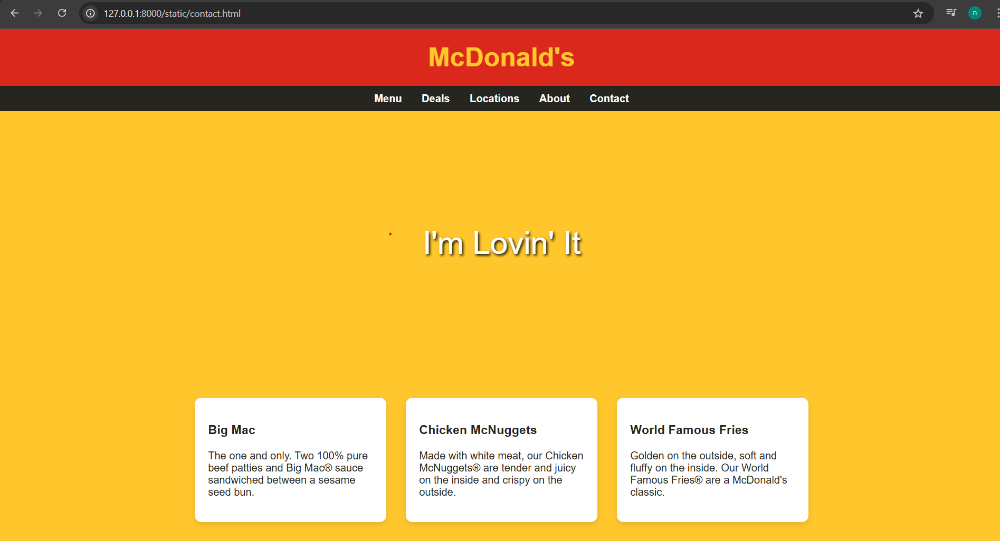

# Ex.07 Restaurant Website
## Date:

## AIM:
To develop a static Restaurant website to display the food items and services provided by them.

## DESIGN STEPS:

### Step 1:
Requirement collection.

### Step 2:
Creating the layout using HTML and CSS.

### Step 3:
Updating the sample content.

### Step 4:
Choose the appropriate style and color scheme.

### Step 5:
Validate the layout in various browsers.

### Step 6:
Validate the HTML code.

### Step 7:
Publish the website in the given URL.

## PROGRAM:
```
<!DOCTYPE html>
<html lang="en">
<head>
    <meta charset="UTF-8">
    <meta name="viewport" content="width=device-width, initial-scale=1.0">
    <title>McDonald's - I'm Lovin' It</title>
    <style>
        body {
            font-family: Arial, sans-serif;
            margin: 0;
            padding: 0;
            background-color: #ffc72c;
            color: #27251f;
        }
        header {
            background-color: #da291c;
            padding: 20px;
            text-align: center;
        }
        .logo {
            color: #ffc72c;
            font-size: 2.5em;
            font-weight: bold;
        }
        nav {
            background-color: #27251f;
            padding: 10px;
        }
        nav ul {
            list-style-type: none;
            margin: 0;
            padding: 0;
            display: flex;
            justify-content: center;
        }
        nav li {
            margin: 0 15px;
        }
        nav a {
            color: white;
            text-decoration: none;
            font-weight: bold;
        }
        .hero {
            background-image: url('mcdonalds-hero.jpg');
            background-size: cover;
            height: 400px;
            display: flex;
            align-items: center;
            justify-content: center;
            color: white;
            text-align: center;
        }
        .slogan {
            font-size: 3em;
            text-shadow: 2px 2px 4px #000;
        }
        .menu-items {
            display: flex;
            flex-wrap: wrap;
            justify-content: center;
            padding: 20px;
        }
        .menu-item {
            background-color: white;
            border-radius: 10px;
            margin: 15px;
            padding: 20px;
            width: 250px;
            box-shadow: 0 4px 8px rgba(0,0,0,0.1);
        }
        footer {
            background-color: #27251f;
            color: white;
            text-align: center;
            padding: 20px;
        }
    </style>
</head>
<body>
    <header>
        <div class="logo">McDonald's</div>
    </header>
    <nav>
        <ul>
            <li><a href="#">Menu</a></li>
            <li><a href="#">Deals</a></li>
            <li><a href="#">Locations</a></li>
            <li><a href="#">About</a></li>
            <li><a href="#">Contact</a></li>
        </ul>
    </nav>
    <div class="hero">
        <div class="slogan">I'm Lovin' It</div>
    </div>
    <div class="menu-items">
        <div class="menu-item">
            <h3>Big Mac</h3>
            <p>The one and only. Two 100% pure beef patties and Big Mac® sauce sandwiched between a sesame seed bun.</p>
        </div>
        <div class="menu-item">
            <h3>Chicken McNuggets</h3>
            <p>Made with white meat, our Chicken McNuggets® are tender and juicy on the inside and crispy on the outside.</p>
        </div>
        <div class="menu-item">
            <h3>World Famous Fries</h3>
            <p>Golden on the outside, soft and fluffy on the inside. Our World Famous Fries® are a McDonald's classic.</p>
        </div>
    </div>
    <footer>
        <p>© 2023 McDonald's. All Rights Reserved.</p>
    </footer>
</body>
</html>
```

## OUTPUT:


## RESULT:
The program for designing software company website using HTML and CSS is completed successfully.
